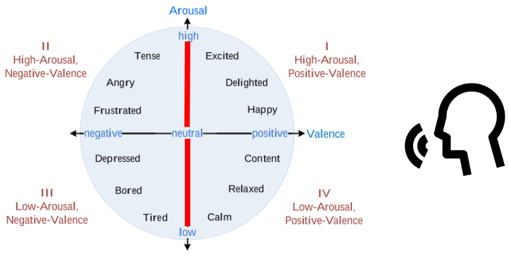
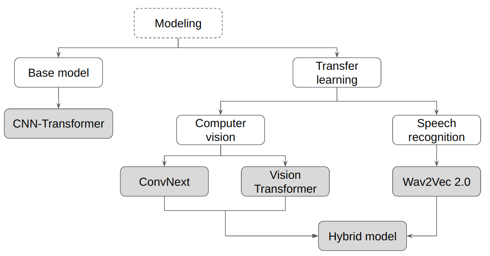
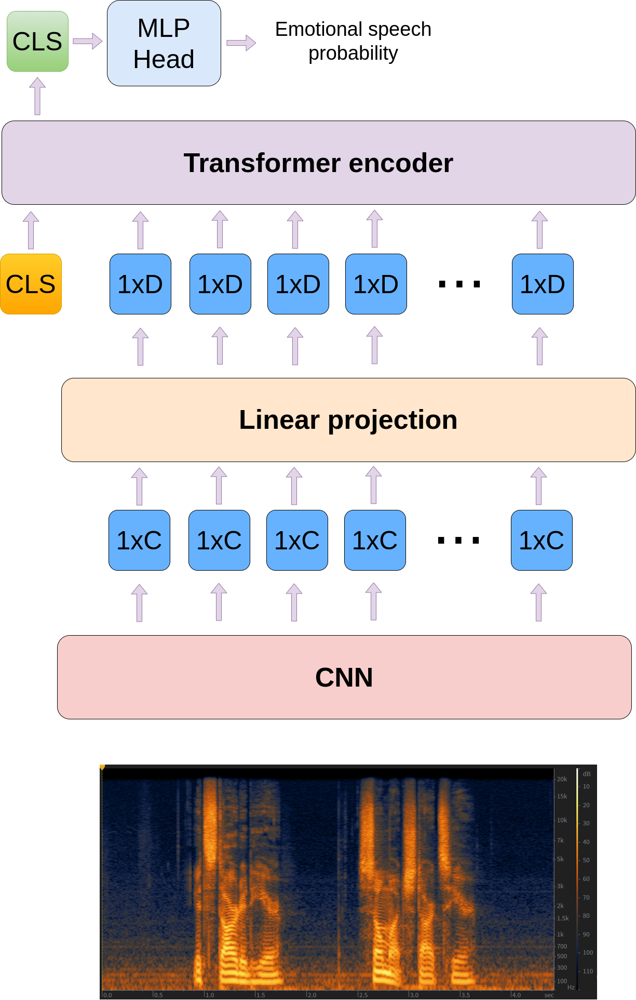
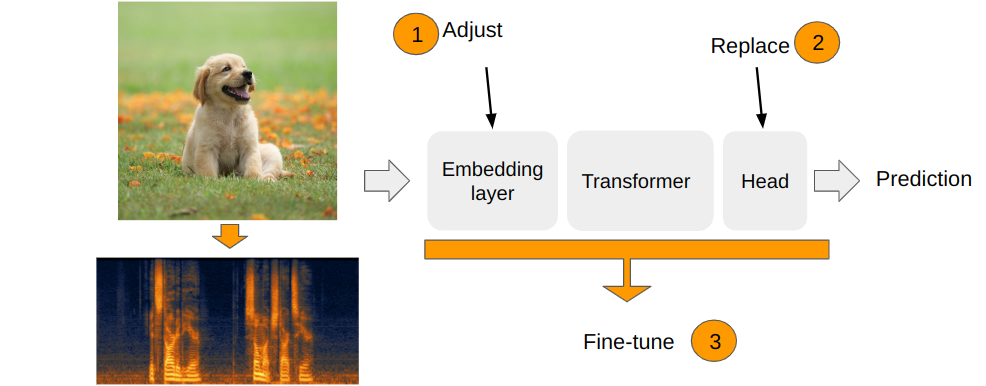
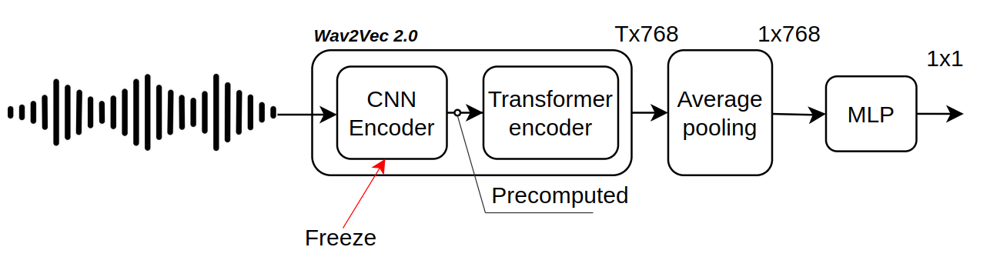
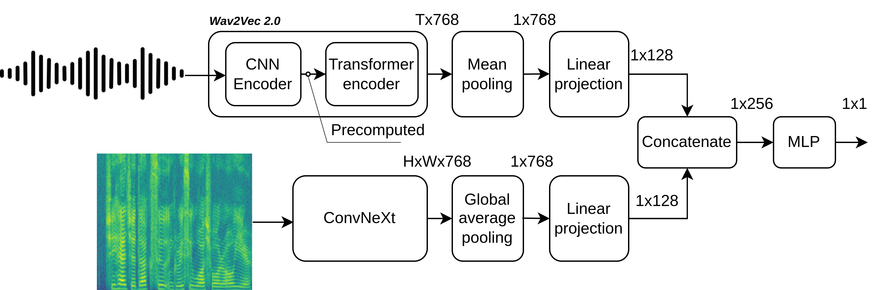

# Active emotion detection | Recognising audio segments with high emotional activation

This project is using large audio [dataset](https://ecs.utdallas.edu/research/researchlabs/msp-lab/MSP-Podcast.html) with emotional annotations to train 5 deep learning models with different architectures to recognise high level of emotional activation in audio segments.

For this projet I developed a custom deep learning framework to configure and run the experiments, as well as to preprocess and load the data.

Most of the models in my experiments are able to learn from mini-batches of different size. For this purpose I developed a [dataloader](https://github.com/ViktorAnchutin/detecting_active_emotion/blob/8eecbd2ed6c3079f40357a8290727d1ebcaf2b61/data/dataloader.py#L21) which builds mini batches from the data of similar length to avoid padding overhead.

To run the experiments I created a [class](https://github.com/ViktorAnchutin/detecting_active_emotion/blob/8eecbd2ed6c3079f40357a8290727d1ebcaf2b61/experiments/experiment_runner.py#L29) which is responsible for initializing and running the training from the provided TrainingConfig. Since some of the models are quite big I added the functionnality of mixed precision training and gradient accumulation.

For evaluation purposes I built a [module](https://github.com/ViktorAnchutin/detecting_active_emotion/blob/8eecbd2ed6c3079f40357a8290727d1ebcaf2b61/framework/metrics.py#L52) which computes such metrics as ROC-AUC, best F1 score and corresponding precision and recall.

________________________________________________

***data*** module - dataloading, datasets creation, data preprocessing

***framework*** module - training logic and tools

***experiments*** module - experiments running and models architecture
___________________________

## Models

### 1. CNN-Transformer

### 2. ConvNext
### 3. ViT (DeiT)

### 4. Wav2Vec 2.0

### 5. Hybrid

